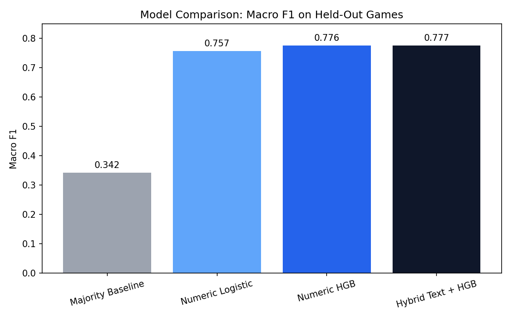
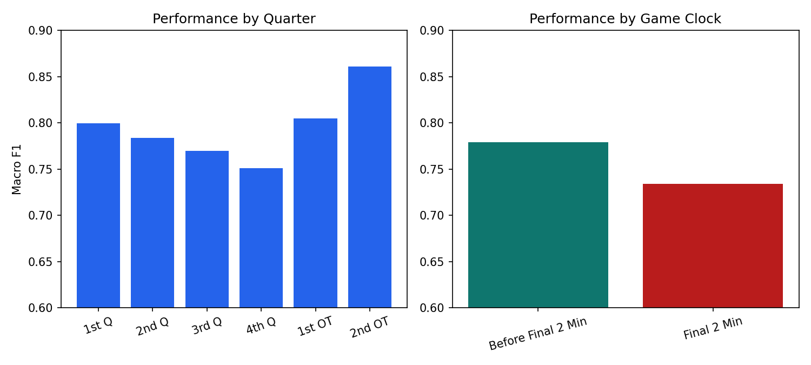

# Predicting Possession Outcomes in NBA Play-by-Play

This project turns raw NBA play-by-play logs from Basketball Reference into a possession-level machine learning pipeline. The final model predicts whether a possession will end in points using score state, game clock, recent possession history, and short text context from recent play descriptions.

In one line: we started with a vague "momentum" idea, discovered that it was too noisy, and reframed the problem into a stronger and more useful task: **predicting whether the current possession will score**.

## Snapshot
- Data source: Basketball Reference play-by-play tables
- Final dataset: `118,450` plays -> `50,654` possessions across `252` games
- Best model: `Hybrid Text + HistGradientBoosting`
- Held-out test performance: `0.786` accuracy, `0.777` macro F1
- Key finding: score margin and recent possession context carry most of the signal; text helps a little





## What This Project Does
1. Downloads raw play-by-play tables from Basketball Reference.
2. Cleans each game into a consistent event table with quarters, scores, and game clock.
3. Combines all games into one parquet corpus with true chronological ordering.
4. Converts play-level events into possession-level samples.
5. Builds predictive features from game state, recent possession history, and text.
6. Trains grouped machine learning models and exports charts, tables, and findings to `results/`.

## Main Findings
- The original "momentum shift in the next 120 seconds" label was too noisy to model well.
- Reframing the task to possession-level scoring produced a much stronger and more interpretable signal.
- The best model, `Hybrid Text + HistGradientBoosting`, reached `0.7766` macro F1 on held-out games.
- The biggest drivers are `offense_score_margin`, `prev_offense_margin`, `prev_possession_points`, `prev_num_events`, and `abs_offense_margin`.
- Performance is strongest earlier in games and weakest in the `4th Q` and final two minutes, which suggests late-game possessions are higher variance and strategically different.

Business-facing summary: [results/reports/business_findings.md](results/reports/business_findings.md)

## Reproducible Setup
Use a clean Python environment and install the packages below.

```bash
python -m venv .venv
source .venv/bin/activate
python -m pip install --upgrade pip
pip install pandas numpy pyarrow requests beautifulsoup4 lxml scikit-learn matplotlib
```

Recommended assumptions:
- Python `3.10+`
- Run commands from the repo root
- If you already have the raw `.csv` files in `data/raw/`, you can skip the download step

## How To Run The Project
Run the pipeline from top to bottom:

```bash
python src/01_download_bref_pbp.py
python src/02_clean_pbp.py
python src/03_build_corpus.py
python src/04_create_labels.py
python src/05_build_features.py
python src/06_train_model.py
```

Notes:
- `01_download_bref_pbp.py` is the only network-dependent step.
- `06_train_model.py` performs grouped train/validation/test evaluation by `game_id`, tunes thresholds on the validation split, and writes organized outputs into `results/charts`, `results/reports`, and `results/tables`.
- To reproduce the current results exactly, keep `RANDOM_STATE = 42` in [src/06_train_model.py](/Users/jaisharma/Documents/Predicting-Momentum-Shifts-in-Basketball-Using-Supervised-Learning/src/06_train_model.py).

## What Each File Does
### Pipeline Scripts
- [src/01_download_bref_pbp.py](/Users/jaisharma/Documents/Predicting-Momentum-Shifts-in-Basketball-Using-Supervised-Learning/src/01_download_bref_pbp.py): downloads Basketball Reference play-by-play tables into `data/raw/`
- [src/02_clean_pbp.py](/Users/jaisharma/Documents/Predicting-Momentum-Shifts-in-Basketball-Using-Supervised-Learning/src/02_clean_pbp.py): cleans raw tables, handles quarter and overtime markers, extracts scores, and writes per-game cleaned files to `data/clean/`
- [src/03_build_corpus.py](/Users/jaisharma/Documents/Predicting-Momentum-Shifts-in-Basketball-Using-Supervised-Learning/src/03_build_corpus.py): concatenates cleaned games, fixes chronology, computes absolute game time, and writes `data/corpus/pbp_all_games.parquet`
- [src/04_create_labels.py](/Users/jaisharma/Documents/Predicting-Momentum-Shifts-in-Basketball-Using-Supervised-Learning/src/04_create_labels.py): converts plays into possession-level samples and labels each possession with whether the offense scored
- [src/05_build_features.py](/Users/jaisharma/Documents/Predicting-Momentum-Shifts-in-Basketball-Using-Supervised-Learning/src/05_build_features.py): creates model features from score state, timing, recent possessions, and text context, then writes `data/model/pbp_features.parquet`
- [src/06_train_model.py](/Users/jaisharma/Documents/Predicting-Momentum-Shifts-in-Basketball-Using-Supervised-Learning/src/06_train_model.py): trains baselines and models, evaluates them on held-out games, and exports results artifacts

### Data Folders
- `data/raw/`: downloaded raw Basketball Reference `.csv` files
- `data/clean/`: cleaned per-game play-by-play files
- `data/corpus/`: merged play corpus and labeled possession dataset
- `data/model/`: final feature table used for training

### Results Folders
- `results/charts/`: exported PNG visualizations
- `results/reports/`: narrative summaries of findings
- `results/tables/`: CSV and JSON evaluation outputs

## Current Best Result
From [results/tables/model_summary.csv](results/tables/model_summary.csv):

| Model | Accuracy | Macro F1 |
|---|---:|---:|
| Majority Baseline | 0.520 | 0.342 |
| Numeric Logistic | 0.769 | 0.757 |
| Numeric HistGradientBoosting | 0.786 | 0.776 |
| Hybrid Text + HistGradientBoosting | **0.786** | **0.777** |

## Where To Look First
- Quick business summary: [results/reports/business_findings.md](results/reports/business_findings.md)
- Model comparison chart: [results/charts/model_comparison_macro_f1.png](results/charts/model_comparison_macro_f1.png)
- Slice performance chart: [results/charts/slice_performance_macro_f1.png](results/charts/slice_performance_macro_f1.png)
- Detailed tables: [results/tables/model_summary.csv](results/tables/model_summary.csv)
